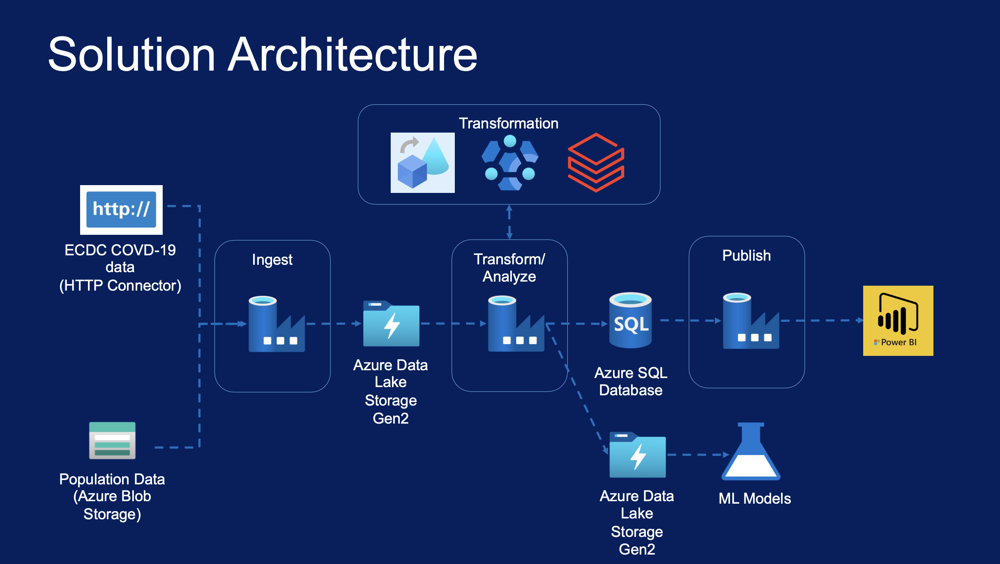
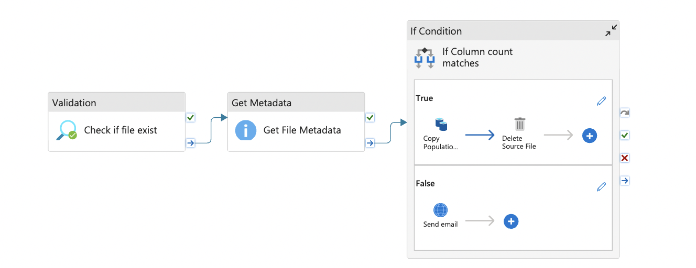
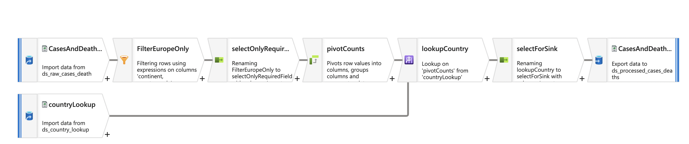
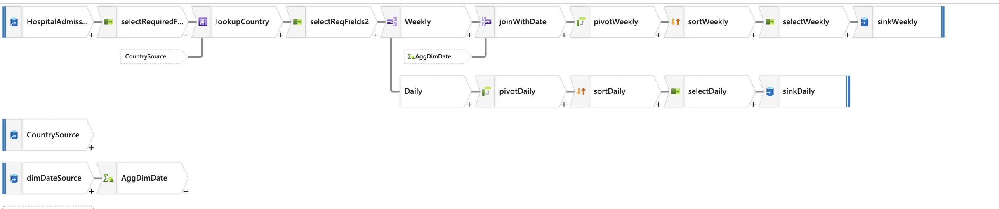

# Azure Data Factory for Covid-19 Data Engineering Project

## Overview
This project harness in-demand data engineering tools in the cloud, Azure Data Factory (ADF)!

## Project Goals
1. **Azure Data Factory**: Learn to use ADF for building and orchestrating data pipelines.
2. **Solution Architecture**: Build a comprehensive data engineering solution using Azure technologies.
3. **Data Integration**: Integrate data from various sources, including HTTP clients, Azure Blob Storage, and Azure Data Lake Gen2.
4. **Control Flow Activities**: Utilize branching and chaining activities in ADF pipelines using control flow activities.
5. **Metadata-Driven Pipelines**: Use parameters and variables in pipelines, datasets, and linked services.
6. **Debugging and Troubleshooting**: Debug data pipelines, resolve issues, and investigate data flow problems.
7. **Scheduling and Triggers**: Schedule pipelines using various triggers like Event Trigger, Schedule Trigger, and Tumbling Window Trigger.
8. **Mapping Data Flows**: Create and debug transformation logic using Mapping Data Flows.
9. **Pipeline Orchestration**: Implement pipelines to invoke HDInsight activities, Databricks notebooks, and orchestrate data flow dependencies.
10. **Monitoring and Alerts**: Monitor pipelines, create alerts, and report metrics using Azure Monitor and Log Analytics.
11. **Azure Storage Solutions**: Learn about Azure Storage Account, Azure Data Lake Gen2, and Azure SQL Database.
12. **HDInsight & Databricks**: Explore HDInsight clusters, Databricks workspace, and notebooks for data transformation.
13. **Azure DevOps (CI/CD)**: Set up CI/CD pipelines in Azure DevOps for releasing ADF artifacts to higher environments.

## Project Description
This project follows a logical progression of real-world project implementation with technical concepts explained as the data pipelines in Azure Data Factory (ADF) are built. Although this course is not specifically designed to teach the skills required for the Azure Data Engineer Associate Certification exam DP203, it greatly helps in gaining most of the necessary skills for the exam.

### Course Content
- **Azure Data Factory**
  - Building a solution architecture for a data engineering solution using Azure Data Engineering technologies such as Azure Data Factory (ADF), Azure Data Lake Gen2, Azure Blob Storage, Azure SQL Database, Azure Databricks, Azure HDInsight, and Microsoft PowerBI.
  - Integrating data from HTTP clients, Azure Blob Storage, and Azure Data Lake Gen2 using Azure Data Factory.
  - Branching and chaining activities in Azure Data Factory (ADF) Pipelines using control flow activities such as Get Metadata, If Condition, ForEach, Delete, and Validation.
  - Using parameters and variables in pipelines, datasets, and linked services to create metadata-driven pipelines in ADF.
  - Debugging data pipelines and resolving issues.
  - Scheduling pipelines using triggers like Event Trigger, Schedule Trigger, and Tumbling Window Trigger.
  - Creating Mapping Data Flows with transformations like Source, Filter, Select, Pivot, Lookup, Conditional Split, Derived Column, Aggregate, Join, and Sink.
  - Debugging data flows, investigating issues, and fixing failures.
  - Implementing ADF pipelines to invoke Mapping Data Flows and executing them.
  - Creating ADF pipelines to execute HDInsight activities and carry out data transformations.
  - Creating ADF pipelines to execute Databricks Notebook activities to carry out transformations.
  - Creating dependencies between pipelines and triggers to orchestrate the data flow.
  - Monitoring data pipelines, creating alerts, and reporting metrics from the ADF Monitor.
  - Using Azure Monitor and Log Analytics for pipeline monitoring and diagnostics.
  - Creating Log Analytics workspace, workbooks, and charts from log analytics on ADF pipelines.
  - Implementing the ADF Analytics monitoring tool and extending its capabilities.

- **Azure Storage Solutions**
  - Creating Azure Storage Account, containers, uploading data, and managing access with IAM.
  - Using Azure Storage Explorer to interact with storage accounts.
  - Creating Azure Data Lake Gen2 and managing containers and access.
  - Creating Azure SQL Database, managing pricing tiers, admin user, tables, loading data, and querying.

- **Azure HDInsight & Databricks**
  - Creating HDInsight clusters, interacting with the UI, using Ambari, creating Hive tables, and invoking HDInsight activities from ADF.
  - Creating Azure Databricks workspace, clusters, mounting storage accounts, creating notebooks, performing transformations, and invoking notebooks from ADF.

- **Azure DevOps (CI/CD)**
  - Creating Azure DevOps environment and configuring Git repository.
  - Implementing CI/CD process for releasing ADF artifacts to higher environments.
  - Creating build and release pipelines in Azure DevOps to release code to higher environments (Test/Prod).
  - Configuring/Parameterizing CI/CD pipelines to release ADF pipelines that access Azure Data Lake Storage.

### Who This Project Is For
- University students looking for a career in Data Engineering.
- IT developers working in other disciplines who want to move to Data Engineering.
- Data Engineers/Data Warehouse Developers currently working on on-premises technologies or other cloud platforms like AWS or GCP who want to learn Azure technologies.
- Data Architects looking to gain an understanding of the Azure Data Engineering stack.
- Data Scientists who want to extend their knowledge into data engineering.

## Visuals

### Project Solution Architecture

### Data Ingestion Pipeline

### Cases and Deaths DataFlow Pipeline

### Hospital Admissions DataFlow Pipeline

